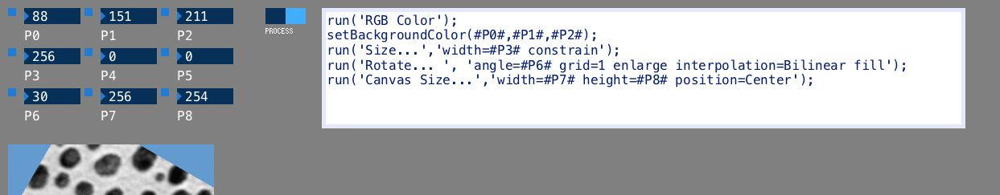

# processingLiveImageJMacros

A Processing sketch that allows testing multiple parameters in an ImageJ macro. See https://twitter.com/jmutterer/status/1091288515013476352 for a demo

Features:

* Accepts images by drag and drop thanks to the Drop library
* Has a basic text editor for macros thanks to the G4P library
* Has numberBox controls for changing parameter values interactively thanks to the ControlP5 library
* Each numberBox has a matching cp5 bang (button) that pastes the proper #P[n]# tag into the editor at carret position
* The Processing draw() function repeatedely:
    * replaces replaces #P[n]# tags in the macro code with matching cp5 controller values
    * applies the modified macro
    * converts back the ImageJ result image to a Processing PImage
    * displays the PImage
    
It would make sense to rewrite this as a proper ImageJ Plugin. Someone?

# Installation

* Download Processing from: https://processing.org/download/
* Start Processing, and install required libraries using the built in library manager:
   * Choose menu item: Sketch > Import Library... > Add Library...
   * Use the library search box and locate libraires G4P, ControlP5 and Drop
   * For adding ImageJ as a library, use the Sketch > Add File... menu and point to the processingLiveImageJMacros/code/ij.jar
* Open Processing_Live_ImageJ_macros.pde and press the IDE's play button
